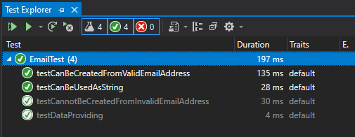

# PHPUnit Test Adapter for PeachPie/PHP Projects

This project implements .NET Test Adapter for PeachPie projects containing PHPUnit tests.

## Please explain

**PeachPie projects** are PHP projects compiled into .NET using [PeachPie](https://www.peachpie.io/). It allows to run the PHP code as a regular .NET language, on top of .NET runtime.
**Test Adapter** is an integration of unit tests into the .NET work flow. You may know it as Visual Studio's Test Explorer or the command line utility `dotnet test`.

This all together allows to **run, debug, and profile** PHPUnit tests on top of .NET runtime, inside the Visual Studio or using other .NET build tools or continuous integration services.

## Sample project

The test project will be a .NET executable application (e.g. TargetFramework `netcoreapp3.1`), compiling the test files (e.g. `tests/**.php`), and referencing the actual PeachPie/PHP application.

*`lib.msbuildproj`*:
```xml
<Project Sdk="Peachpie.NET.Sdk/1.0.0-preview3">
  <PropertyGroup>
    <TargetFramework>netcoreapp3.1</TargetFramework>
  </PropertyGroup>
  <ItemGroup>
    <Compile Include="**/*.php" />
    <PackageReference Include="Microsoft.NET.Test.Sdk" Version="16.6.1" />
    <PackageReference Include="PHPUnit.TestAdapter" Version="9.2.6-preview3" />
  </ItemGroup>
</Project>
```

*file structure*:
```
- src
  - Email.php
- tests
  - EmailTest.php
- phpunit.xml
- lib.msbuildproj
```

*usage*:

- In Visual Studio:

    Open the project in Visual Studio. Navigate to Test / Test Explorer, and continue by running or debugging the discovered tests.

    
    
- On command line:

    ```
    dotnet test
    ```

## Repository structure

- `src/PHPUnit.TestAdapter` - The test adapter for VSTest enabling to run PHPUnit tests from `dotnet test` and Test Explorer in Microsoft Visual Studio. The project references PHPUnit package, and utilizes its API to drive tests discovery and tests execution.
- `src/phpunit.phpunit.phar` - [PHPUnit](https://phpunit.de) compiled with Peachpie to a .NET Standard assembly. The file `phpunit.phar` gets downloaded automatically. 
- `src/dotnet-phpunit` - An optional command line tool `dotnet phpunit` that runs [PHPUnit](https://phpunit.de) on a PeachPie project.

The test adapter can be tested on the following sample:

- `samples/Lib` - A simple .NET/PHP application with PHPUnit tests.

## Test Adapter for VSTest

To run them from the command line, navigate to `samples/Lib` and run:

```
dotnet test
```

The output should be similar to this one (possibly preceeded by the build log):

```
Test run for samples\Lib\bin\Debug\netcoreapp3.1\Lib.dll(.NETCoreApp,Version=v3.1)
Microsoft (R) Test Execution Command Line Tool Version 16.6.0
Copyright (c) Microsoft Corporation.  All rights reserved.

Starting test execution, please wait...

A total of 1 test files matched the specified pattern.

Test Run Successful.
Total tests: 3
     Passed: 3
 Total time: 4.2106 Seconds
```

You can also open either of these projects in Microsoft Visual Studio and use the **Test Explorer** window to inspect the existing tests, run, debug, and profile them.

## `dotnet phpunit`

To test `dotnet-phpunit` on `samples/Lib` (which references `phpunit.phpunit.phar` as a project), just run it using the default launch settings.

To test it, run the following commands in the directory `samples/Lib`:

```
dotnet tool install --global dotnet-phpunit
dotnet build
dotnet phpunit
```

Both variants should run PHPUnit with the output similar to this one:
```
Runner of PHPUnit (© Sebastian Bergmann) on PHP assemblies compiled by Peachpie

Building "samples\Lib\Lib.msbuildproj"...
Opening assembly "samples\Lib\obj\Debug\netstandard2.0\Lib.dll"...
Assembly loaded

PHPUnit 9.2.6 by Sebastian Bergmann and contributors.

...                                                                 3 / 3 (100%)

Time: 00:00.696, Memory: 39.29 KB

OK (3 tests, 3 assertions)
```

To explicitly disable building of the project (as it's already built), pass the `--no-build` option to `dotnet phunit`, e.g.:

```
dotnet phpunit --no-build
```

If you wish to remove `dotnet-phpunit` from the set of installed tools, run:

```
dotnet tool uninstall --global dotnet-phpunit
```
